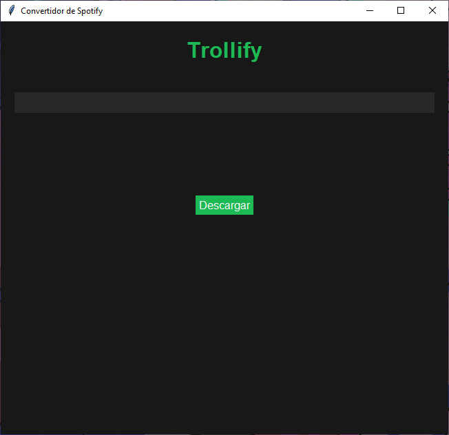
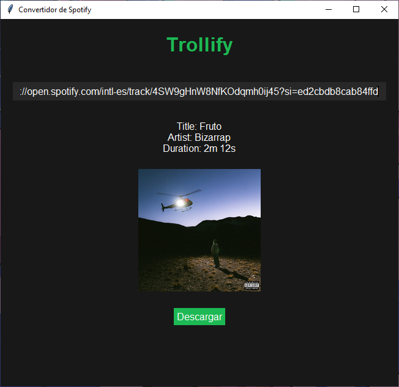

# TROLLIFY

## Descripción

Este proyecto es una aplicación de escritorio que te permite descargar canciones y playlists de Spotify como archivos MP3 utilizando `spotipy` para obtener la información de las pistas y `yt-dlp` para descargar el audio desde YouTube.

## Características

- Descarga canciones individuales desde Spotify en formato MP3.
- Descarga playlists completas de Spotify.
- Interfaz gráfica amigable construida con `Tkinter`.
- Muestra información relevante sobre la canción o playlist seleccionada, como título, artista, duración y portada.
- Barra de progreso para visualizar el estado de la descarga.

## Requisitos

Para ejecutar este proyecto, necesitas tener instalados los siguientes componentes:

- Python 3.6 o superior
- Paquetes Python:
  - `spotipy`
  - `yt-dlp`
  - `Pillow`
  - `requests`
- [FFmpeg](https://ffmpeg.org/download.html) (asegúrate de que `ffmpeg` esté disponible en tu variable de entorno PATH).

## Instalación

1. Clona este repositorio:
   ```bash
   git clone https://github.com/tu-usuario/spotify-downloader.git
   cd spotify-downloader
2. Instala las dependencias del proyecto:
   ```bash
   pip install -r requirements.txt
3. Asegúrate de tener ffmpeg instalado y disponible en el PATH de tu sistema operativo. [Guía de instalación de FFmpeg](https://ffmpeg.org/download.html)

## Verificar la Instalación de FFmpeg
Para asegurarte de que ffmpeg está instalado y configurado correctamente, puedes usar el script de prueba `prueba.py`.
1. Ejecuta el script con el siguiente comando:
   ```bash
   python main.py
2. Si el script descarga correctamente el archivo de prueba y no muestra errores, entonces ffmpeg está instalado y configurado correctamente.

## Uso

1. Ejecuta la aplicación:
   ```bash
   python main.py
2. Introduce la URL de una canción o playlist de Spotify en el campo correspondiente.
3. Haz clic en "Descargar" para iniciar la descarga. La barra de progreso se mostrará una vez que comience la descarga.
4. Los archivos descargados se guardarán en la carpeta Descargas dentro del directorio del proyecto.

## Capturas de Pantalla

<div style="text-align: center;">
  
  
</div>
<div style="text-align: center; margin-top: 20px;">
  
</div>

## Contribuciones

Las contribuciones son bienvenidas. Por favor, sigue los siguientes pasos:
1. Haz un fork del repositorio.
2. Crea una nueva rama (git checkout -b feature/nueva-funcionalidad).
3. Realiza tus cambios y haz commit (git commit -am 'Añadir nueva funcionalidad').
4. Haz push a la rama (git push origin feature/nueva-funcionalidad).
5. Abre un Pull Request.

## Licencia

Este proyecto está licenciado bajo la Licencia MIT. Para más detalles, consulta el archivo `LICENSE`.

## Agradecimientos

- [Spotipy](https://spotipy.readthedocs.io/en/2.16.1/) - Cliente de API de Spotify para Python.
- [yt-dlp](https://github.com/yt-dlp/yt-dlp) - Descargador de videos/audio de YouTube.
